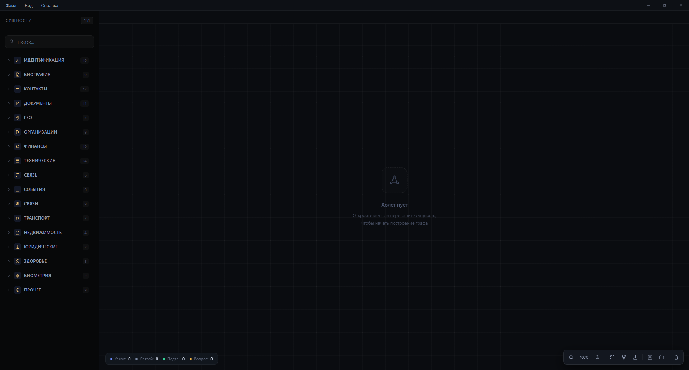

# OSINT Graph Studio

**Локальное приложение для Windows для ручного построения и анализа графов связей.** Добавляйте сущности, соединяйте их, прикрепляйте материалы и сохраняйте рабочие кейсы в зашифрованные файлы `.osin`.

> **Важно:** приложение — инструмент для организации пользовательских данных. Оно не выполняет автоматический поиск по сайтам или внешним OSINT-провайдерам и не подтверждает достоверность введённых сведений. Используйте его только законно и с надлежащими полномочиями.

> **Состояние проекта:** Ранняя версия. Приложение находится в активной разработке: возможны ошибки, сбои и недоработки. Формат данных и отдельные функции могут меняться в будущих выпусках. Мы постепенно исправляем найденные проблемы и улучшаем программу.

## Возможности

- **Интерактивный граф:** создавайте узлы и направленные связи, редактируйте подписи и статус связи — подтверждённый, под вопросом или без статуса.
- **Каталог типов сущностей:** люди и идентификаторы, биография, контакты и соцсети, документы, география, организации, финансы, технические данные, события, отношения, транспорт, недвижимость, юридические и медицинские категории, заметки и файлы. Каталог — это шаблоны для ручного ввода, а не проверка или получение этих данных.
- **Холсты и вкладки:** несколько холстов, переключение, переименование, перетаскивание вкладок для изменения порядка, создание, закрытие и восстановление рабочего состояния.
- **Работа с графом:** поиск по данным узлов и меткам связей, выделение, копирование/вставка, дублирование, отмена/повтор, режим фокуса и автоматические раскладки.
- **Вложения:** добавляйте файл к подходящему узлу, заменяйте и удаляйте вложение, просматривайте изображения, обрезайте их и сохраняйте любое вложение через диалог выбора файла. Файлы, которые приложение не умеет отображать (PDF, документы, архивы и т. п.), можно хранить и выгружать как вложения.
- **Экспорт графа:** PNG, SVG, PDF и GraphML.
- **Настройки интерфейса:** русский и английский языки, тёмные темы, акцентный цвет, размер шрифта, семейство шрифтов, анимации и визуальные параметры.
- **Автовосстановление:** локальное сохранение состояния холстов, чтобы случайное закрытие не привело к потере работы.

## Скриншоты

## Горячие клавиши

| Клавиши | Действие |
|---|---|
| `Ctrl+K` | Командная палитра |
| `Ctrl+E` | Экспорт графа |
| `Ctrl+L` | Меню раскладок |
| `Ctrl+O` | Открыть `.osin` |
| `Ctrl+S` | Сохранить |
| `Ctrl+Shift+S` | Сохранить как… |
| `Ctrl+T` | Создать холст |
| `Ctrl+W` | Закрыть активный холст |
| `Ctrl+Shift+X` | Очистить холст |
| `Ctrl+Z` | Отменить действие |
| `Ctrl+Y` или `Ctrl+Shift+Z` | Повторить действие |
| `Ctrl+A` | Выделить все узлы |
| `Ctrl+C` / `Ctrl+V` | Копировать / вставить выделенное |
| `Ctrl+D` | Дублировать выделенное |
| `Ctrl+F` | Поиск по холсту |
| `Ctrl+H` | Переключить режим фокуса |
| `Shift+F` | Показать выделенное |
| `Shift` + перетаскивание узла | Привязка узла к сетке |
| `Shift` + перетаскивание по пустому холсту | Рамка выделения |
| `Ctrl` + щелчок | Мультивыбор |
| `Shift` + щелчок | Добавить элемент к выделению |
| `Ctrl+Alt` + левая кнопка мыши | Быстрое создание узла |
| `Ctrl++` / `Ctrl+-` | Приблизить / отдалить |
| `Ctrl+0` | Масштаб 100% |
| `F` | Показать весь граф |
| `Delete` или `Backspace` | Удалить выделенное |
| `Esc` | Закрыть активную панель или отменить текущий режим |
| `1` / `2` / `0` | Статус выбранной связи: подтверждена / под вопросом / без статуса |
| `L` / `R` | Добавить или изменить метку / развернуть выбранную связь |
| `Ctrl+Alt` + колесо мыши | Изменить размер шрифта интерфейса |

Все горячие клавиши также перечислены в разделе **Настройки → Горячие клавиши**. Для управления связью сначала откройте её контекстное меню.

## Файлы и защита данных

### Файлы `.osin`

- Формат `.osin` версии 3 использует AES-256-GCM. Заголовок файла аутентифицируется вместе с содержимым, поэтому подмена или повреждение байтов внутри файла обнаруживается при открытии.
- Пароль при сохранении и открытии не запрашивается. Приложение при первом запуске создаёт случайный ключ шифрования длиной 32 байта и хранит его в локальном каталоге данных приложения, в файле `app.key`.
- Путь к ключу на Windows: %LOCALAPPDATA%<app-id>\app.key
- **Не удаляйте и не теряйте `app.key`.** Сам файл `.osin` ключ не содержит. При потере ключа открыть связанные с ним `.osin` не получится.
- **Чтобы перенести кейс на другой компьютер**, скопируйте оба файла: сам `.osin` и соответствующий ему `app.key`, и разместите `app.key` в каталоге данных приложения на новой машине. Оба файла храните и переносите в защищённом месте.
- Формат v3 несовместим с более ранними версиями и со старыми JSON-файлами `.osin`; автоматической миграции нет. Откройте и пересохраните такие файлы предыдущей версией программы либо заведите кейс заново.
- Максимальный размер `.osin` — 100 MiB; одного вложения — 25 MiB.

### Важные ограничения безопасности

- Шифрование относится только к сохраняемому `.osin`-файлу. **Временные снимки состояния в локальном хранилище приложения и внутреннее хранилище вложений отдельно не зашифрованы.** Не используйте приложение для особо чувствительных данных на общем или недоверенном компьютере.
- Ключ хранится локально рядом с данными приложения. Это не защита от вредоносной программы или человека, имеющего доступ к вашей учётной записи и файлам приложения.
- Экспортированные PNG/SVG/PDF/GraphML и файлы, сохранённые из вложений, не шифруются автоматически. Храните и передавайте их осторожно.
- Приложение не выполняет сетевых запросов и не передаёт данные третьим сторонам. Вводимые сведения и файлы всё равно могут быть доступны пользователям и программам с доступом к этому компьютеру.

## Скачать и установить

1. Откройте вкладку **Releases** этого репозитория.
2. Скачайте установщик для Windows из нужного выпуска — `.exe` (NSIS) или `.msi`.
3. Запустите установщик и следуйте его указаниям.
4. После установки запустите **OSINT Graph Studio** из меню «Пуск».

Если Windows показывает предупреждение SmartScreen, не обходите его автоматически: сначала проверьте, что файл скачан именно со страницы релиза этого репозитория. Не скачивайте `.exe` из случайных зеркал.

### Системные требования

Приложение не требует отдельной видеокарты и постоянного подключения к интернету.

**Базовые (для обычной работы с графами):**

| Параметр | Значение |
|---|---|
| ОС | Windows 10 или Windows 11, 64-разрядная |
| Процессор | Современный двухъядерный или лучше |
| ОЗУ | от 4 ГБ (комфортнее — 8 ГБ) |
| Видеокарта | Встроенной достаточно |
| Дополнительно | WebView2 Runtime — обычно уже есть в Windows 10/11 |

**Для крупных графов и множества вложений:**

| Параметр | Значение |
|---|---|
| Процессор | 4+ ядра |
| ОЗУ | 16 ГБ |

> Это ориентировочная рекомендация. Формальные минимальные требования и предел комфортного размера графа отдельно не тестировались.

## Известные ограничения

- Это ручной редактор графов: автоматический поиск, обогащение профилей, проверка фактов и подключение внешних сервисов не выполняются.
- Временные снимки состояния и внутреннее хранилище вложений хранятся локально, но не зашифрованы отдельно от `.osin`.
- Утрата `app.key` означает утрату возможности открыть связанные с ним `.osin`.
- Старые файлы `.osin` предыдущих версий формата не открываются в текущей версии без ручного пересохранения.
- Приложение находится в предварительной стадии: возможны ошибки, и формат данных может измениться в будущих выпусках.

## Обратная связь

Если нашли ошибку или хотите предложить улучшение — создайте обращение во вкладке **Issues** этого репозитория. По возможности приложите:

- версию программы;
- версию Windows;
- короткое описание шагов, которые приводят к проблеме;
- скриншот или текст ошибки.

Пожалуйста, не прикладывайте к обращению свои рабочие `.osin`-файлы и `app.key`: они могут содержать чувствительные данные и ключ шифрования.

## Отказ от ответственности

Программа предоставляется «как есть», без каких-либо гарантий. Автор и владелец программы не несут ответственности за любые прямые или косвенные последствия использования приложения: за потерю, повреждение или утечку данных, за возможный ущерб, за действия третьих лиц, а также за то, каким образом пользователь собирает, хранит, обрабатывает, экспортирует и распространяет сведения. Всю ответственность за использование программы и введённых в неё данных несёт исключительно сам пользователь. Используя приложение, вы подтверждаете, что делаете это осознанно, на свой риск и в рамках применимого законодательства.

## Ответственное использование

Пользователь отвечает за законность сбора, обработки, хранения, экспорта и распространения введённых сведений. Не используйте программу для преследования, нарушения приватности, дискриминации или иных незаконных действий. Программа не является юридической, следственной или аналитической рекомендацией, а отображённые связи не являются доказательством.
